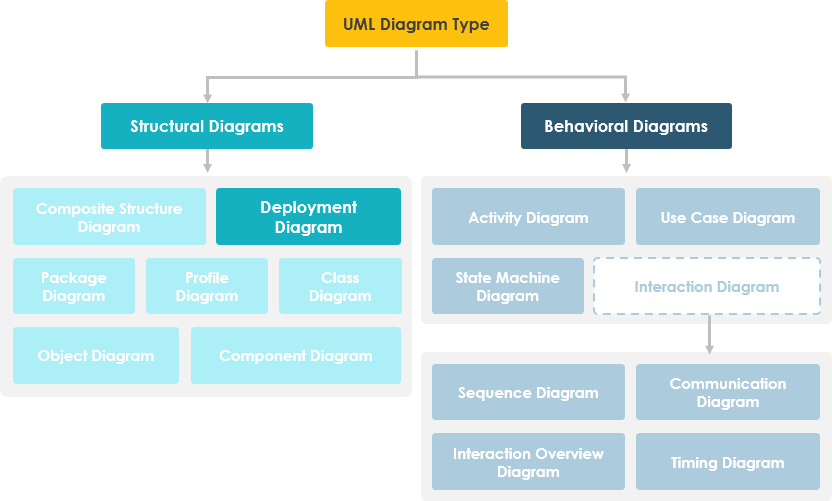

# Course Checkpoint 13

---

---

## Cuales son las partes de un diagrama de clases y explique cada una de ellas

El diagrama de clase UML es una notación gráfica utilizada para construir y visualizar sistemas orientados a objetos. Un diagrama de clases en el Lenguaje de modelado unificado (UML) es un tipo de diagrama de estructura estática que describe la estructura de un sistema mostrando los siguientes elementos del sistema:

- clases,
- sus atributos,
- operaciones (o métodos),
- y las relaciones entre los objetos.

### ¿Qué es una clase?

Una clase es un plano para un objeto. Los objetos y las clases van de la mano. No podemos hablar de uno sin hablar del otro. Y todo el punto del Diseño Orientado a Objetos no se trata de objetos, se trata de clases, porque usamos clases para crear objetos. Así que una clase describe lo que será un objeto, pero no es el objeto en sí.

De hecho, las clases describen el tipo de objetos, mientras que los objetos son instancias utilizables de clases. Cada objeto se construyó a partir del mismo conjunto de planos y, por lo tanto, contiene los mismos componentes (propiedades y métodos). El significado estándar es que un objeto es una instancia de una clase y un objeto: los objetos tienen estados y comportamientos.

#### ejemplo

Un perro tiene estados - color, nombre, raza, así como comportamientos - menearse, ladrar, comer. Un objeto es una instancia de una clase.

### Notación de clase de UML

Una clase representa un concepto que encapsula estado (atributos) y comportamiento (operaciones). Cada atributo tiene un tipo. Cada operación tiene una firma. El nombre de la clase es la única información obligatoria.

##### Nombre de clase

- El nombre de la clase aparece en la primera partición.

##### Atributos de clase

- Los atributos se muestran en la segunda partición.
- El tipo de atributo se muestra después de los dos puntos.
- Los atributos se asignan a variables miembro (miembros de datos) en el código.

##### Operaciones de clase (métodos)

- Las operaciones se muestran en la tercera partición. Son servicios que ofrece la clase.
- El tipo de retorno de un método se muestra después de los dos puntos al final de la firma del método.
- El tipo devuelto de los parámetros del método se muestra después de los dos puntos que siguen al nombre del parámetro.

Las operaciones se asignan a los métodos de clase en el código

#### Visibilidad de clase

Los símbolos +, - y # antes de un atributo y un nombre de operación en una clase denotan la visibilidad del atributo y la operación.

- \+ denota atributos u operaciones públicas
- \- denota atributos u operaciones privadas
- \# denota atributos u operaciones protegidas

#### Direccionalidad del parámetro

Cada parámetro en una operación (método) se puede denotar como dentro, fuera o entrada que especifica su dirección con respecto al llamante. Esta direccionalidad se muestra antes del nombre del parámetro.

### Perspectivas del diagrama de clases

La elección de la perspectiva depende de lo avanzado que esté en el proceso de desarrollo. Durante la formulación de un modelo de dominio, por ejemplo, rara vez se pasa de la perspectiva conceptual. Los modelos de análisis típicamente presentarán una mezcla de perspectivas conceptuales y de especificación. El desarrollo del modelo de diseño generalmente comenzará con un gran énfasis en la perspectiva de la especificación y evolucionará hacia la perspectiva de la implementación.

Un diagrama se puede interpretar desde varias perspectivas:

- Conceptual: representa los conceptos en el dominio
- Especificación: se centra en las interfaces de tipo de datos abstractos (ADT) en el software
- Implementación: describe cómo las clases implementarán sus interfaces

La perspectiva afecta la cantidad de detalles que se proporcionarán y los tipos de relaciones que vale la pena presentar. Como mencionamos anteriormente, el nombre de la clase es la única información obligatoria.

### Relaciones entre clases

UML no se trata solo de imágenes bonitas. Si se usa correctamente, UML transmite con precisión cómo se debe implementar el código a partir de diagramas. Si se interpreta con precisión, el código implementado reflejará correctamente la intención del diseñador. ¿Puede describir qué significa cada una de las relaciones en relación con su lenguaje de programación de destino que se muestra en la siguiente figura?

Si aún no puede reconocerlos, no hay problema, esta sección está destinada a ayudarlo a comprender las relaciones de clase de UML. Una clase puede estar involucrada en una o más relaciones con otras clases. Una relación puede ser uno de los siguientes tipos:

#### Herencia (o generalización)

Una generalización es una relación taxonómica entre un clasificador más general y un clasificador más específico. Cada instancia del clasificador específico es también una instancia indirecta del clasificador general. Por lo tanto, el clasificador específico hereda las características del clasificador más general.

- Representa una relación «es-a».
- Un nombre de clase abstracto se muestra en cursiva.
- SubClass1 y SubClass2 son especializaciones de SuperClass.

La siguiente figura muestra un ejemplo de jerarquía de herencia. SubClass1 y SubClass2 se derivan de SuperClass. La relación se muestra como una línea continua con una punta de flecha hueca que apunta desde el elemento hijo al elemento padre.

#### Ejemplo de herencia - Formas

La siguiente figura muestra un ejemplo de herencia con dos estilos. Aunque los conectores se dibujan de manera diferente, son semánticamente equivalentes.

### asociación

Las asociaciones son relaciones entre clases en un diagrama de clases de UML. Están representados por una línea sólida entre clases. Las asociaciones se denominan típicamente usando un verbo o frase verbal que refleja el dominio del problema del mundo real.

##### Asociación sencilla

- Un vínculo estructural entre dos clases de pares.
- Existe una asociación entre Class1 y Class2

La siguiente figura muestra un ejemplo de asociación simple. Existe una asociación que conecta la clase < < control > > Class1 y la clase < < boundary > > Class2. La relación se muestra como una línea continua que conecta las dos clases.

##### Cardinalidad

La cardinalidad se expresa en términos de:

- uno a uno
- de uno a muchos
- muchos a muchos

##### agregación

Un tipo especial de asociación.

- Representa una «parte de» relación.
- Class2 es parte de Class1.
- Muchas instancias (indicadas por el \*) de Class2 pueden asociarse con Class1.
- Los objetos de Class1 y Class2 tienen vidas separadas.

La siguiente figura muestra un ejemplo de agregación. La relación se muestra como una línea sólida con un diamante sin rellenar en el extremo de asociación, que está conectado a la clase que representa el agregado.

##### Composición

- -Un tipo especial de agregación donde las partes se destruyen cuando se destruye el todo.
- Los objetos de Class2 viven y mueren con Class1.
- Class2 puede sostenerse por sí mismo.

La siguiente figura muestra un ejemplo de composición. La relación se muestra como una línea sólida con un diamante relleno en el extremo de asociación, que está conectado a la clase que representa el conjunto o compuesto.

##### Dependencia

Un objeto de una clase puede utilizar un objeto de otra clase en el código de un método. Si el objeto no se almacena en ningún campo, se modela como una relación de dependencia.

- Un tipo especial de asociación.
- Existe entre dos clases si los cambios en la definición de una pueden causar cambios en la otra (pero no al revés).
- Class1 depende de Class2

La siguiente figura muestra un ejemplo de dependencia. La relación se muestra como una línea discontinua con una flecha abierta.

La siguiente figura muestra otro ejemplo de dependencia. La clase Person puede tener un método hasRead con un parámetro Book que devuelve true si la persona ha leído el libro (quizás comprobando alguna base de datos).

##### Realización

La realización es una relación entre la clase blueprint y el objeto que contiene sus respectivos detalles de nivel de implementación. Se dice que este objeto realiza la clase blueprint. En otras palabras, puede entender esto como la relación entre la interfaz y la clase de implementación.

Por ejemplo, la interfaz Owner puede especificar métodos para adquirir propiedades y disponer de ellas. Las clases Persona y Corporación necesitan implementar estos métodos, posiblemente de maneras muy diferentes.

### Ejemplo de diagrama de clase: Sistema de pedidos

### Ejemplo de diagrama de clase: GUI

Un diagrama de clases también puede tener notas adjuntas a clases o relaciones.

## Explique los diagramas de despliegue o implementación, y porque los utilizamos?

Un diagrama de implementación de UML es un diagrama que muestra la configuración de los nodos de procesamiento en tiempo de ejecución y los componentes que viven en ellos. Los diagramas de implementación son un tipo de diagrama de estructura utilizado para modelar los aspectos físicos de un sistema orientado a objetos. A menudo se utilizan para modelar la vista de implementación estática de un sistema (topología del hardware).

### Cuándo utilizar el diagrama de implementación

- ¿Con qué sistemas existentes necesitará interactuar o integrarse el sistema recién agregado?
- ¿Qué tan robusto debe ser el sistema (por ejemplo, hardware redundante en caso de una falla del sistema)?
- Qué y quién se conectará o interactuará con el sistema, y cómo lo harán
- ¿Qué middleware, incluido el sistema operativo y los enfoques y protocolos de comunicaciones, utilizará el sistema?
- ¿Con qué hardware y software interactuarán directamente los usuarios (PC, computadoras de red, navegadores, etc.)?
- ¿Cómo supervisará el sistema una vez implementado?
- ¿Qué tan seguro debe ser el sistema (necesita un firewall, hardware físicamente seguro, etc.)?

### Propósito de los diagramas de implementación

- Muestran la estructura del sistema de tiempo de ejecución
- Capturan el hardware que se utilizará para implementar el sistema y los enlaces entre diferentes elementos de hardware.
- Modelan los elementos de hardware físico y las vías de comunicación entre ellos
- Se pueden utilizar para planificar la arquitectura de un sistema.
- También son útiles para Documentar la implementación de componentes de software o nodos

### Diagrama de implementación de un vistazo

Los diagramas de implementación son importantes para visualizar, especificar y documentar sistemas integrados, cliente/servidor y distribuidos, y también para administrar sistemas ejecutables mediante ingeniería directa e inversa.

Un diagrama de implementación es solo un tipo especial de diagrama de clases, que se centra en los nodos de un sistema. Gráficamente, un diagrama de implementación es una colección de vértices y arcos. Los diagramas de implementación suelen contener:

#### Nodos

- 3-D cuadro representa un nodo, ya sea de software o de hardware
- El nodo HW se puede significar con < < estereotipo > >
- Las conexiones entre nodos se representan con una línea, con < < estereotipo > > opcional
- Los nodos pueden residir dentro de un nodo

#### Otras anotaciones

- Dependencia
- Relaciones de asociación.
- También puede contener notas y restricciones.

### Pasos para modelar un sistema integrado

1. Identifique los dispositivos y nodos que son exclusivos de su sistema.
2. Proporcione señales visuales, especialmente para dispositivos inusuales, utilizando los mecanismos de extensibilidad del UML para definir estereotipos específicos del sistema con iconos apropiados. Como mínimo, querrá distinguir procesadores (que contienen componentes de software) y dispositivos (que, en ese nivel de abstracción, no contienen software directamente).
3. Modele las relaciones entre estos procesadores y dispositivos en un diagrama de implementación. Del mismo modo, especifique la relación entre los componentes de la vista de implementación del sistema y los nodos de la vista de implementación del sistema.
4. Según sea necesario, amplíe cualquier dispositivo inteligente modelando su estructura con un diagrama de implementación más detallado.

### Pasos para modelar un sistema cliente/servidor

1. Identifique los nodos que representan los procesadores de cliente y servidor de su sistema.
2. Resalte aquellos dispositivos que están relacionados con el comportamiento de su sistema. Por ejemplo, querrá modelar dispositivos especiales, como lectores de tarjetas de crédito, lectores de insignias y dispositivos de visualización que no sean monitores, porque es probable que su ubicación en la topología de hardware del sistema sea arquitectónicamente significativa.
3. Proporcione señales visuales para estos procesadores y dispositivos a través de estereotipos.
4. Modele la topología de estos nodos en un diagrama de implementación. Del mismo modo, especifique la relación entre los componentes de la vista de implementación del sistema y los nodos de la vista de implementación del sistema.

El ejemplo muestra la topología de un sistema de recursos humanos, que sigue una arquitectura clásica de cliente/servidor.

### Ejemplo de Cliente/Servidor TCP/IP

### Ejemplo de diagrama de implementación - Modelado de un sistema distribuido

1. Identifique los dispositivos y procesadores del sistema como sistemas cliente/servidor más simples.
2. Si necesita razonar sobre el rendimiento de la red del sistema o el impacto de los cambios en la red, asegúrese de modelar estos dispositivos de comunicación al nivel de detalle suficiente para realizar estas evaluaciones.
3. Preste mucha atención a las agrupaciones lógicas de nodos, que puede especificar mediante el uso de paquetes.
4. Modele estos dispositivos y procesadores mediante diagramas de implementación. Siempre que sea posible, utilice herramientas que descubran la topología del sistema recorriendo la red del sistema.
5. Si necesita centrarse en la dinámica de su sistema, introduzca diagramas de casos de uso para especificar los tipos de comportamiento que le interesan y amplíe estos casos de uso con diagramas de interacción.
6. Al modelar un sistema completamente distribuido, es común reificar la red como un nodo. es decir, Internet, LAN, WAN como nodos

El Ejemplo muestra la topología de un sistema completamente distribuido.

### Ejemplo de diagrama de implementación - Sistema distribuido corporativo

### Lista de comprobación de planificación de implementación

Cuando está redactando una planificación de implementación para su empresa, es posible que no sepa por dónde empezar o en qué debe concentrarse. La siguiente lista de comprobación puede darle algunas ideas sobre la planificación de la implementación:

- ¿Cómo se instalará su sistema?

1. ¿Quién lo instalará? ¿Cuánto tiempo debería tardar en instalarse?
2. ¿Dónde puede fallar la instalación?
3. ¿Cómo retrocede si la instalación falla? ¿Cuánto tiempo se tarda en retroceder?
4. ¿Cuál es su ventana de instalación (durante qué período de tiempo puede instalar su sistema)?
5. ¿Qué respaldos necesita antes de la instalación?
6. ¿Necesitas hacer una conversión de datos?
7. ¿Cómo sabe que la instalación se realizó correctamente?

- Si diferentes versiones del sistema estarán en producción al mismo tiempo, ¿cómo resolverá las diferencias?
- ¿En qué sitios físicos necesita implementar y en qué orden?

1. ¿Cómo capacitará a su personal de soporte y operaciones?
2. ¿Necesita implementar un sistema de soporte de producción para que el personal de soporte utilice su propio entorno para simular problemas?

- ¿Cómo formarás a tus usuarios?

1. ¿Qué documentación y en qué formatos e idiomas necesitan sus usuarios y el personal de soporte y operación?
2. ¿Cómo se implementarán las actualizaciones de la documentación?

## Que es un diagrama de actividad?

El diagrama de actividad es otro diagrama de comportamiento importante en el diagrama UML para describir aspectos dinámicos del sistema. El diagrama de actividad es esencialmente una versión avanzada del diagrama de flujo que modela el flujo de una actividad a otra actividad.

### Cuándo usar el diagrama de actividad

Los diagramas de actividad describen cómo se coordinan las actividades para proporcionar un servicio que puede estar en diferentes niveles de abstracción. Típicamente, un evento debe lograrse mediante algunas operaciones, particularmente cuando la operación está destinada a lograr una serie de cosas diferentes que requieren coordinación, o cómo los eventos en un solo caso de uso se relacionan entre sí, en particular, casos de uso donde las actividades pueden superponerse y requerir coordinación. También es adecuado para modelar cómo se coordina una colección de casos de uso para representar flujos de trabajo empresariales

1. Identificar casos de uso de candidatos, a través del examen de los flujos de trabajo del negocio
2. Identificar las condiciones previas y posteriores (el contexto) para los casos de uso
3. Modelar flujos de trabajo entre/dentro de casos de uso
4. Modelar flujos de trabajo complejos en operaciones sobre objetos
5. Modele en detalle actividades complejas en un diagrama de actividad de alto nivel

### Diagrama de actividad - Aprender por ejemplos

Un diagrama de actividad básico - diagrama de flujo como

### Diagrama de actividad - Modelado de un procesador de textos

El siguiente ejemplo de diagrama de actividad describe el flujo de trabajo de un proceso de Word para crear un documento a través de los siguientes pasos:

- Abra el paquete de procesamiento de texto.
- Crear un archivo.
- Guarde el archivo con un nombre único dentro de su directorio.
- Escriba el documento.
- Si los gráficos son necesarios, abra el paquete de gráficos, cree los gráficos y péguelos en el documento.
- Si es necesaria una hoja de cálculo, abra el paquete de la hoja de cálculo, cree la hoja de cálculo y péguela en el documento.
- Guarde el archivo.
- Imprima una copia impresa del documento.
- Salga del paquete de procesamiento de texto.

### Ejemplo de diagrama de actividad - Orden de proceso

Dada la descripción del problema relacionado con el flujo de trabajo para procesar un pedido, modelemos la descripción en representación visual utilizando un diagrama de actividad:

Orden de proceso - Descripción del problema

Una vez recibido el pedido, las actividades se dividen en dos conjuntos paralelos de actividades. Un lado llena y envía el pedido mientras que el otro se encarga de la facturación.

En el lado de la orden de llenado, el método de entrega se decide condicionalmente. Dependiendo de la condición, se realiza la actividad de entrega nocturna o la actividad de entrega regular.

Finalmente las actividades paralelas se combinan para cerrar el orden.

El siguiente ejemplo de diagrama de actividad visualiza el flujo en forma gráfica.

### Ejemplo de diagrama de actividad - Inscripción de estudiantes

Este ejemplo de diagrama de actividad de UML describe un proceso para la inscripción de estudiantes en una universidad de la siguiente manera:

- Un solicitante quiere inscribirse en la universidad.
- El solicitante entrega una copia completa del Formulario de Inscripción.
- El registrador inspecciona los formularios.
- El registrador determina que los formularios se han llenado correctamente.
- El registrador informa al estudiante para asistir en la presentación de visión general de la universidad.
- El registrador ayuda al estudiante a inscribirse en seminarios
- El registrador le pide al estudiante que pague la matrícula inicial.

### Diagrama de actividad - Swimlane

Un swimlane es una forma de agrupar actividades realizadas por el mismo actor en un diagrama de actividad o diagrama de actividad o de agrupar actividades en un solo hilo. Aquí hay un ejemplo de un diagrama de actividad de Swimlane para modelar la presentación de gastos de personal:

### Diagrama de actividad de Swimlane y no Swimlane

El siguiente ejemplo de diagrama de actividad describe el proceso empresarial para conocer a un nuevo cliente mediante un diagrama de actividad sin Swimlane.

La siguiente figura describe el proceso empresarial para conocer a un nuevo cliente mediante un diagrama de actividad con Swimlane.

### Resumen de la notación del diagrama de actividad

#### Actividad: Se utiliza para representar un conjunto de acciones 

#### Acción: Una tarea a realizar 

#### Flujo de control: Muestra la secuencia de ejecución y Flujo de objetos: Mostrar el flujo de un objeto de una actividad (o acción) a otra actividad (o acción) 

#### Nodo inicial: Retrata el comienzo de un conjunto de acciones o actividades 

#### Nodo final de actividad: Detener todos los flujos de control y los flujos de objetos de una actividad (o acción) 

#### Nodo de objeto: Representar un objeto que está conectado a un conjunto de flujos de objetos 

#### Nodo de decisión: Representar una condición de prueba para garantizar que el flujo de control o el flujo de objetos sólo descienda por un trayecto 

#### Nodo de combinación: Vuelva a reunir diferentes rutas de decisión que se crearon utilizando un nodo de decisión 

#### Nodo de bifurcación: Dividir el comportamiento en un conjunto de flujos paralelos o concurrentes de actividades (o acciones) 

#### Nodo de unión: Reunir de nuevo un conjunto de flujos paralelos o concurrentes de actividades (o acciones) 

#### Swimlane y partición: Forma de agrupar actividades realizadas por el mismo actor en un diagrama de actividades o de agrupar actividades en un solo subproceso 

## Que es un diagrama de maquina de estado?

El comportamiento de una entidad no es solo una consecuencia directa de sus entradas, sino que también depende de su estado anterior. La historia pasada de una entidad se puede modelar mejor mediante un diagrama de máquina de estado finito o tradicionalmente llamado autómata. Los diagramas de máquina de estado de UML (o a veces denominados diagrama de estado, máquina de estado o gráfico de estado) muestran los diferentes estados de una entidad. Los diagramas de máquina de estados también pueden mostrar cómo una entidad responde a varios eventos cambiando de un estado a otro. El diagrama de máquina de estado es un diagrama UML utilizado para modelar la naturaleza dinámica de un sistema.

### ¿Por qué diagramas de máquina de estado?

El diagrama de máquina de estados se utiliza normalmente para describir el comportamiento dependiente del estado de un objeto. Un objeto responde de manera diferente al mismo evento dependiendo del estado en el que se encuentre. Los diagramas de máquina de estado generalmente se aplican a objetos, pero se pueden aplicar a cualquier elemento que tenga comportamiento a otras entidades, como: actores, casos de uso, métodos, sistemas de subsistemas, etc., y generalmente se usan junto con diagramas de interacción (generalmente diagramas de secuencia).

Por ejemplo:

Considere que tiene $100,000 en una cuenta bancaria. El comportamiento de la función de retiro sería: balance: = balance - withdrawAmount; siempre que el saldo después del retiro no sea inferior a $0; esto es cierto independientemente de cuántas veces haya retirado dinero del banco. En tales situaciones, los retiros no afectan a la abstracción de los valores de atributo, y por lo tanto el comportamiento bruto del objeto permanece sin cambios.

Sin embargo, si el saldo de la cuenta se volviera negativo después de un retiro, el comportamiento de la función de retiro sería bastante diferente. Esto se debe a que el estado de la cuenta bancaria cambia de positivo a negativo; en la jerga técnica, se dispara una transición del estado positivo al estado negativo.

La abstracción del valor del atributo es una propiedad del sistema, en lugar de una regla aplicable globalmente. Por ejemplo, si el banco cambia la regla de negocios para permitir que el saldo bancario se sobregire en 2000 dólares, el estado de la cuenta bancaria se redefinirá con la condición de que el saldo después del retiro no debe ser inferior a $2000 en déficit.

Tenga en cuenta que:

- Un diagrama de máquina de estados describe todos los eventos (y estados y transiciones para un solo objeto)
- Un diagrama de secuencia describe los eventos de una única interacción en todos los objetos implicados

### Conceptos básicos del diagrama de máquina de estado

#### ¿Qué es un Estado?

Rumbaugh define que:

"Un estado es una abstracción de los valores de atributos y enlaces de un objeto. Los conjuntos de valores se agrupan en un estado según las propiedades que afectan al comportamiento bruto del objeto ".

### Características de las notaciones de máquina de estado

Hay varias características de los estados en general, independientemente de sus tipos:

- Un estado ocupa un intervalo de tiempo.
- Un estado se asocia a menudo con una abstracción de valores de atributo de una entidad que satisface algunas condiciones.
- Una entidad cambia su estado no solo como consecuencia directa de la entrada actual, sino que también depende de algún historial pasado de sus entradas.

#### Estado

Un estado es una restricción o una situación en el ciclo de vida de un objeto, en el que una restricción se mantiene, el objeto ejecuta una actividad o espera un evento.

Un diagrama de máquina de estados es un gráfico que consta de:

- Estados (estados simples o estados compuestos)
- Transiciones de estado que conectan los estados

Ejemplo:

#### Características del Estado

- El estado representa las condiciones de los objetos en ciertos puntos en el tiempo.
- Los objetos (o sistemas) se pueden ver como moviéndose de un estado a otro
- Un punto en el ciclo de vida de un elemento de modelo que satisface alguna condición, donde se realiza alguna acción particular o donde se espera algún evento

##### Estados inicial y final

- El estado inicial de un diagrama de máquina de estado, conocido como pseudo-estado inicial, se indica con un círculo sólido. Una transición desde este estado mostrará el primer estado real
- El estado final de un diagrama de máquina de estado se muestra como círculos concéntricos. Una máquina de estado de bucle abierto representa un objeto que puede terminar antes de que finalice el sistema, mientras que un diagrama de máquina de estado de bucle cerrado no tiene un estado final; si es el caso, entonces el objeto vive hasta que todo el sistema termina.

Ejemplo:

#### Acontecimientos

Una firma de evento se describe como Event-name (lista de parámetros separados por comas). Los eventos aparecen en el compartimento de transición interno de un estado o en una transición entre estados. Un evento puede ser uno de cuatro tipos:

1. Evento de señal - correspondiente a la llegada de un mensaje o señal asíncrona
2. Evento de llamada: correspondiente a la llegada de una llamada de procedimiento a una operación
3. Evento de tiempo: un evento de tiempo se produce después de que haya transcurrido un tiempo especificado
4. Evento de cambio: se produce un evento de cambio siempre que se cumple una condición especificada

#### Características de los eventos

- Representa incidentes que hacen que los objetos pasen de un estado a otro.
- Los eventos internos o externos desencadenan alguna actividad que cambia el estado del sistema y de algunas de sus partes
- Los eventos pasan información, que es elaborada por las operaciones de Objetos. Los objetos realizan eventos
- El diseño implica examinar eventos en un diagrama de máquina de estado y considerar cómo esos eventos serán soportados por los objetos del sistema

#### Transición

Las líneas de transición representan el movimiento de un estado a otro. Cada línea de transición está etiquetada con el evento que causa la transición.

- Ver un sistema como un conjunto de estados y transiciones entre estados es muy útil para describir comportamientos complejos
- Comprender las transiciones de estado es parte del análisis y diseño del sistema
- Una transición es el movimiento de un estado a otro estado
- Las transiciones entre estados se producen de la siguiente manera:

1. Un elemento está en estado de origen
2. Se produce un evento
3. Se realiza una acción
4. El elemento entra en un estado de destino

- Las transiciones múltiples ocurren cuando diferentes eventos dan como resultado la terminación de un estado o cuando hay condiciones de protección en las transiciones
- Una transición sin un evento y una acción se conoce como transiciones automáticas

#### Acciones

La acción es un cálculo atómico ejecutable, que incluye llamadas de operación, la creación o destrucción de otro objeto o el envío de una señal a un objeto. Una acción se asocia con transiciones y durante las cuales una acción no es interrumpible, por ejemplo, entrada, salida

#### Actividad

La actividad está asociada con estados, que es un cálculo no atómico o en curso. La actividad puede ejecutarse hasta su finalización o continuar indefinidamente. Una actividad será terminada por un evento que causa una transición desde el estado en el que se define la actividad

#### Características de la acción y las actividades

- Los estados pueden desencadenar acciones
- Los estados pueden tener un segundo compartimento que contenga acciones o actividades realizadas mientras una entidad se encuentra en un estado determinado
- Una acción es una ejecución atómica y por lo tanto se completa sin interrupción
- Cinco desencadenadores para acciones: Al entrar, Hacer, Al evento, Al salir e Incluir
- Una actividad captura un comportamiento complejo que puede ejecutarse durante una larga duración: una actividad puede ser interrumpida por eventos, en cuyo caso no se completa cuando un objeto llega a un estado.

### Notación de diagrama de máquina de estado simple

#### Acciones de entrada y salida

Acciones de entrada y salida especificadas en el estado. Debe ser verdadero para cada ocurrencia de entrada/salida. Si no es así, debe utilizar acciones en los arcos de transición individuales

- Entrada Acción ejecutada al entrar en el estado con la notación: Entrada/acción
- Exit Acción ejecutada al salir del estado con la notación: Exit/action

#### Ejemplo: acción de entrada/salida (comprobar el estado de la libreta)

Este ejemplo ilustra un diagrama de máquina de estados derivado de una clase - «BookCopy»:

Nota:

1. Este diagrama de máquina de estados muestra el estado de un objeto myBkCopy de una clase BookCopy
2. Acción de entrada: cualquier acción que se marque como vinculada a la acción de entrada se ejecuta siempre que se ingrese el estado dado a través de una transición
3. Acción de salida: cualquier acción que esté marcada como vinculada a la acción de salida se ejecuta siempre que el estado se deja a través de una transición

#### Subestados

Un estado simple es aquel que no tiene subestructura. Un estado que tiene subestados (estados anidados) se denomina estado compuesto. Los subestados pueden anidarse a cualquier nivel. Una máquina de estado anidada puede tener como máximo un estado inicial y un estado final. Los subestados se utilizan para simplificar máquinas de estado plano complejas al mostrar que algunos estados solo son posibles dentro de un contexto particular (el estado envolvente).

Ejemplo de subestado - Calentador

Los diagramas de máquina de estado se utilizan a menudo para derivar casos de prueba, aquí hay una lista de posibles ideas de prueba:

- El estado inactivo recibe el evento Too Hot
- El estado inactivo recibe el evento Too Cool
- El estado de enfriamiento/inicio recibe el evento Compressor Running
- El estado Cooling/Ready recibe el evento Fan Running
- El estado de enfriamiento/ejecución recibe el evento OK
- El estado de enfriamiento/ejecución recibe el evento de falla
- El estado de falla recibe el evento Error eliminado
- El estado de calentamiento recibe el evento OK
- El estado de calentamiento recibe el evento de falla

#### Estados de la historia

A menos que se especifique lo contrario, cuando una transición entra en un estado compuesto, la acción de la máquina de estado anidada comienza de nuevo en el estado inicial (a menos que la transición se dirija directamente a un subestado). Los estados históricos permiten que la máquina de estados vuelva a entrar en el último subestado que estaba activo antes de abandonar el estado compuesto. En la figura siguiente se presenta un ejemplo del uso del estado del historial.

#### Estado simultáneo

Como se mencionó anteriormente, los estados en los diagramas de máquina de estado se pueden anidar. Los estados relacionados se pueden agrupar juntos en un solo estado compuesto. Los estados de anidación dentro de otros son necesarios cuando una actividad implica subactividades concurrentes. El siguiente diagrama de máquina de estado modela una subasta con dos subestados simultáneos: procesar la puja y autorizar el límite de pago.

Ejemplo de diagrama de máquina de estado concurrente - Proceso de subasta

En este ejemplo, la máquina de estado que entra por primera vez en la subasta requiere una bifurcación al principio en dos hilos de inicio separados. Cada subestado tiene un estado de salida para marcar el final de la rosca. A menos que haya una salida anormal (Cancelada o Rechazada), la salida del estado compuesto se produce cuando ambos subestados han salido.

## Explique de que manera el diseño de un sistema a través de los diagramas de UML ayuda al proceso de desarrollo de un sistema?

Muchos programadores, ante la difícil tarea, descuidan la etapa de diseño, citando que el diseño es una pérdida de tiempo, y en este caso sólo me interferirá.

A menudo esta afirmación resulta ser correcta si la tarea y la verdad es pequeña y la calificación del programador es suficiente para determinar la solución más óptima.

Los programadores que no utilizan UML se dividen en varios grupos:

- empezaré a escribir el código, y en el proceso entenderé que sí como;
- leo foros, habr, medium, stack overflow, libro, entradas en las paredes, signos de más...;
- apuesto a mis colegas, tal vez alguien sabe cómo resolver una tarea similar;
- comenzaré a dibujar cuadráticos y mostraré esquemáticamente qué visión de la tarea se formó en mi mente.

Pero al abordar problemas más complejos, la planificación anticipada y la simulación simplifican enormemente la programación. Además, es más fácil realizar cambios en los gráficos de clase que en el código fuente.

Se puede hacer una analogía con la construcción de una casa. Cuando alguien quiere construir una casa, no solo golpea con un martillo y se pone a trabajar. Necesita tener un plan, un plan de diseño, para poder analizar y modificar su sistema.

Si ya has empezado a describir en papel tu tarea, ya es un gran plus.

### Qué es UML

UML es un lenguaje de modelado unificado (Unified Modeling Language) es un sistema de notación que se puede aplicar al análisis y diseño orientado a objetos. Se puede utilizar para visualizar, especificar, diseñar y documentar sistemas de software.

En pocas palabras, si se ven las imágenes en los motores de búsqueda, se entenderá que UML es algo sobre esquemas, flechas y cuadráticos.

Es importante que UML se traduzca como Lenguaje de Modelado Unificado. Lo principal aquí es la palabra Unified. Es decir, nuestras imágenes no solo las entenderemos nosotros, sino también a los demás que conocen UML. Resulta que es un lenguaje internacional de dibujo de circuitos.

#### Pros y contras del diseño UML

Contras:

- pérdida de tiempo;
- la necesidad de conocer los diferentes diagramas y sus notaciones.

Ventajas:

- la posibilidad de mirar la tarea desde diferentes perspectivas;
- a otros programadores les resulta más fácil comprender la esencia de la tarea y la forma en que se realiza;
- los gráficos son relativamente fáciles de leer después de familiarizarse con su sintaxis lo suficientemente rápido.

Para determinar si es necesario utilizar UML, debe considerar los gráficos básicos. Gracias a ellos se desarrolla un panorama general que da una idea de las posibilidades de expresión de ideas arquitectónicas dentro de los retos empresariales.

Todos los gráficos que se presentan a continuación están relacionados entre sí. Al combinarlos, podemos lograr el nivel necesario de descomposición de las tareas individuales.
